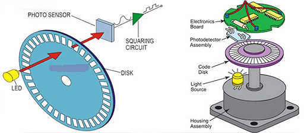
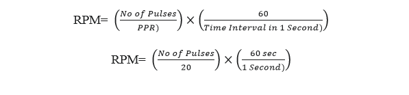

An Encoder is a sensor that translates mechanical motion into an electronic signal. Encoders are fundamental to control systems, providing critical feedback on position, speed, and direction. This project uses an Incremental encoder, which generates a series of digital pulses as its shaft rotates. These pulses are counted to determine the motor's speed.

The core of an incremental encoder's operation lies in its simple design: a rotating disk with precisely spaced holes or slots, and an optical sensor consisting of an IR Emitter and an IR Receiver.
•	**IR Emitter**: An infrared LED that sends out a beam of infrared light.
•	**IR Receiver:** A phototransistor that detects the infrared light.
As the encoder's disk rotates with the motor's shaft, the holes allow the IR light to pass through, creating a digital pulse (HIGH signal) for each hole detected. The number of holes on the disk determines the Pulses Per Revolution (PPR). In your code, the PPR is set to 20, meaning the encoder generates 20 pulses for every full revolution of the motor shaft.
Because the encoder's raw output is often a weak or "noisy" signal, it must be conditioned before the Arduino can read it reliably. This is where the Op-Amp and NPN transistor come in:
•	**IC 741 Op-Amp**: Configured as a comparator, it converts the weak, analog-like signal from the encoder into a clean, sharp digital pulse (either 0V or 5V).
•	**NPN Transistor**: It acts as a switch and amplifier, allowing the Arduino's low-power signal to drive the motor and other components. The transistor ensures a strong, reliable signal is sent to the Arduino’s interrupt pin.
The Arduino then uses a hardware interrupt to count the pulses. An interrupt is a highly efficient method where the Arduino's hardware automatically executes a specific function, the Interrupt Service Routine (ISR), every time a pulse is detected on its designated interrupt pin (digital pin 2 and 3). This prevents the Arduino from missing pulses, which is crucial for accurate speed measurement.
The final RPM is calculated based on the number of pulses counted within a specific time interval (give 1 second in code). This calculation provides a direct and accurate measurement of the motor's speed, which is then displayed on the LCD.

**Formula in Detail**
The core formula is based on three main variables: the number of pulses counted, the encoder's PPR (Pulses Per Revolution), and the time interval over which the pulses were counted.
The general formula is:

-	Number of Pulses (Count): This is the total number of pulses that the Arduino's interrupt service routine (ISR) counts during the measurement period. This value is directly proportional to the motor's speed the faster the motor spins, the more pulses the encoder generates.
-	PPR (Pulses Per Revolution): This is a fixed value determined by the encoder's hardware.  In project uses an encoder with 20 PPR, meaning it produces 20 pulses for every full rotation of the motor shaft.
-	Time Interval in Seconds: This is the fixed duration during which the Arduino counts the pulses. In code sets the interval to 1000 milliseconds, which is equal to a second.

**Formula Works:**
The formula works by first converting the pulses into revolutions and then scaling that result to a minute.
1.	Pulses to Revolutions: The first part of the formula converts the total pulse count into revolutions.

The Simplified Formula using Code
Because code uses of 1000ms (a second) Interval and a PPR of 20, the formula simplifies significantly.
In short Formula for,                Pulses=   (Number of  RPM)/3
In short Formula for,              RPM= Pulses ×3
Applications:
1.	Robotics: Used in robotic arms and mobile robots to monitor the precise angle and speed of joints and wheels, ensuring accurate movement and positioning.
2.	CNC Machines: for precision control of cutting tools and workpieces, ensuring that movements are accurate and repeatable.
3.	Industrial Automation: Used on conveyor belts to measure the speed of materials, on assembly lines for synchronized movements, and in packaging machinery to control the rate of production.
4.	Printers and Plotters: Encoders are used to control the movement of the print head carriage, ensuring that text and images are printed in the correct position.
5.	Automotive Industry: Anti-lock braking systems (ABS) to measure wheel speed and in power steering systems to detect the rotation of the steering wheel.

**Components Used in this Project**
-	Microcontroller: Arduino Uno
-	Input Devices: Incremental Encoder, 20kΩ Potentiometer
-	Output Devices: 12V DC Motor, 16x2 LCD Display (I2C)
-	Interface Components: Op-Amp: IC 741, Transistor: NPN Transistor
-	Power Sources: 12V DC Power Supply and 5V DC Power Supply (from Arduino)

**Microcontroller Connections**
The microcontroller serves as the project's central processing unit, receiving input from the encoder and controlling the display.
-	Incremental Encoder: The encoder's output signal is connected to the Arduino's digital pin 2 & 3, which is configured as an interrupt pin to efficiently count pulses.
-	I2C LCD Display: The display is connected to the Arduino using the I2C protocol, which simplifies wiring by using only four pins: VCC, GND, SDA (A4), and SCL (A5).
-	Potentiometer: The potentiometer is connected in the motor's power circuit to regulate the motor's speed. The Op-Amp and NPN transistor are connected between the potentiometer and the Arduino to condition the signal from the encoder.

