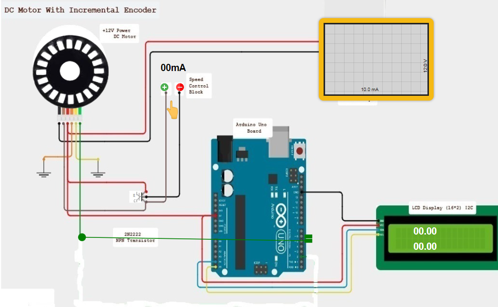
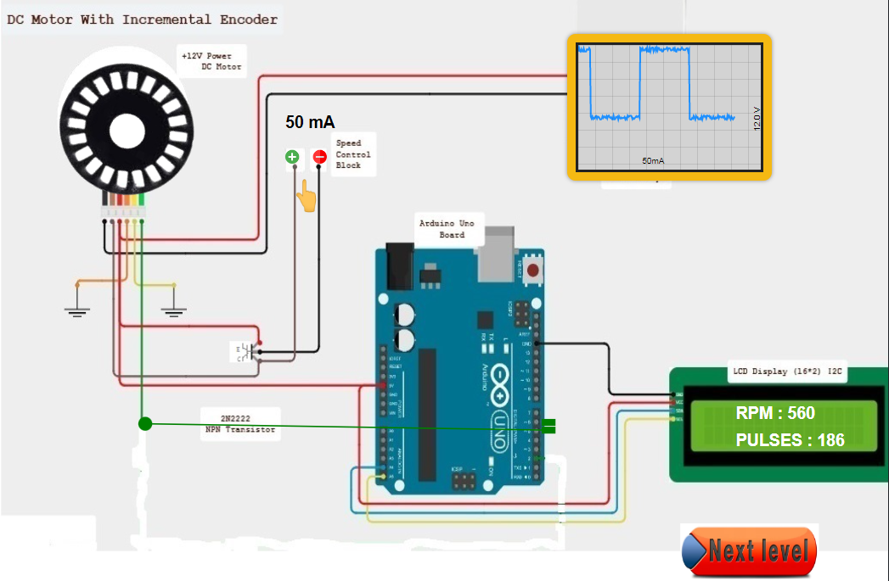

### Procedure

Step 1 - Select Input Pin For Incremental Encoder. 
Step 2 - Click on "GENERATE CODE" button to generate code. 
Step 3 - Click on "COMPILE" button to compile code. 
Step 4 - Click on "EXECUTE" button to execute code. 
Step 5 - Click on "DOWNLOAD" button to download code. 
Step 6 - Click on green circle to connect pin. 
 
Step 7 - Click on any green rectangle to connect pin. 
 
Step 8 - Click on plus Button to increse Speed and click on minus button to decrease speed 
 
Step 9 -Observe Oscilloscope to generated graph waves 
 
Step 10 - Click on "Next level" button 

If you want to download Result click on "DOWNLOAD REPORT" button.