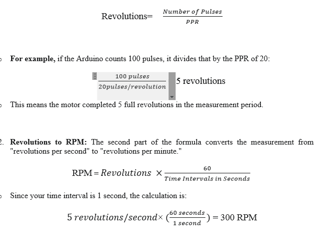

Incremental encoders belong to the family of . They are used to obtain rotarty encoders.
They are used to obtain information such as:
- Position
-  Angle
-  Rotational Speed

Incremental rotary encoders are found mainly in applications
where the measurement of speed/angular velocity is required.
This is done by counting the number of pulses per unit time generated by the encoder.
 **Fig 1**
Incremental encoders cannot provide information when the shaft is not rotating. They can only provide information about the motion of the shaft.
The pulses generated by the incremental rotary encoder must be calculated and processed elsewhere. This can be an Arduino UNO Micro controller. Using the pulse
count, the controller can then convert the information into information like position, speed
and distance.

Incremental Encoders come in two configurations:
-  Single channel incremental encoders
-  Dual channel (Quadrature) encoders
Their functionalities are almost similar to each other. However dual channel encoders
allow us to detect the direction of rotation which a single channel encoder cannot.
The functional principle of an incremental rotary encoder is fairly straightforward. The
sensor consists of a rotating, slotted disk attached to the shaft of it.
When the shaft is rotating, the disk also rotates as shown in the figure below. This is also
known as a ‘code wheel’ .
 **Fig 2**
The slots in the wheel are used to generate ‘pulses’ each time a slot comes in
alignment with the sensor. Incremental rotary encoders use technologies such
as magnetic, optical, inductive, and capacitive and laser to generate this Pulse Train.

   The above diagram illustrates the operation of an optical incremental rotary encoder, A
light source (LED) is placed across the disk and the receiving device (a
photodiode/phototransistor) is placed in the line of sight.

	When the disk rotates, the slots momentarily allow light to pass through. At this moment,
the light beam reaches the receiver, and outputs a logic HIGH signal.
When the disk rotates further, the light beam is obstructed and the receiver does not
receive the beam. This causes the output of that corresponding channel to go logic
LOW.

 **Fig 3**

 Depending on which channel (A or B) indicates a rising edge first, the direction can also
be detected. Single channel encoders only have the channel A output and can only
output a single pulse train.

In the Experiment, we are using the encoder's single signal wire (Channel A) and
connecting it to two different input pins on the Arduino (PD2 and PD3). This setup means
the Arduino gets the same pulse signal twice, allowing the system to focus only on
measuring the total amount of movement (the motor's speed). because we lack the
second, offset signal (Channel B) needed for quadrature decoding, this configuration
cannot determine the direction the motor is spinning.

Disk rotates with the motor's shaft, the holes allow the IR light to pass through, creating a
digital pulse (HIGH signal) for each hole detected. The number of holes on the disk
determines the Pulses Per Revolution (PPR). In your code, the PPR is set to 20, meaning
the encoder generates 20 pulses for every full revolution of the motor shaft.

Because the encoder's raw output is often a weak or "noisy" signal, it must be
conditioned before the Arduino can read it reliably. This is where NPN transistor come in:

NPN Transistor: It acts as a switch and amplifier, allowing the Arduino's low-power signal
to drive the motor and other components. The transistor ensures a strong, reliable signal
is sent to the Arduino’ s interrupt pin.

The Arduino then uses a hardware interrupt to count the pulses. An interrupt is a highly
efficient method where the Arduino's hardware automatically executes a specific
function, the Interrupt Service Routine (ISR), every time a pulse is detected on its
designated interrupt pin (digital pin 2 & 3). This prevents the Arduino frommissing pulses,
which is crucial for accurate speed measurement.

The final RPM is calculated based on the number of pulses counted within a specific time
interval (give 1 second in code). This calculation provides a direct and accurate
measurement of the motor's speed, which is then displayed on the LCD.

**Formula in Detail**
The core formula is based on three main variables: the number of pulses counted, the encoder's PPR (Pulses Per Revolution), and the time interval over which the pulses were counted. 
The general formula is:
 
-	Number of Pulses (Count): This is the total number of pulses that the Arduino's interrupt service routine (ISR) counts during the measurement period. This value is directly proportional to the motor's speed the faster the motor spins, the more pulses the encoder generates.
-	PPR (Pulses Per Revolution): This is a fixed value determined by the encoder's hardware.  In project uses an encoder with 20 PPR, meaning it produces 20 pulses for every full rotation of the motor shaft.
-	Time Interval in Seconds: This is the fixed duration during which the Arduino counts the pulses. In code sets the interval to 1000 milliseconds, which is equal to a second. 

**Formula Works:**
The formula works by first converting the pulses into revolutions and then scaling that result to a minute.
1.	Pulses to Revolutions: The first part of the formula converts the total pulse count into revolutions. 
 
The Simplified Formula using Code
Because code uses of 1000ms (a second) Interval and a PPR of 20, the formula simplifies significantly.
In short Formula for,                Pulses=   (Number of  RPM)/3 
In short Formula for,              RPM= Pulses ×3 

An Incremental Encoder is a sensor that translates mechanical motion into an electronic signal.This project uses an Incremental encoder, which generates a series of digital pulses as its shaft rotates. These pulses are counted to determine the motor's speed. 

 
This experiment design only for INCREMENTAL ENCODER CHANNEL (A) PIN
The core of an incremental encoder's operation lies in its simple design: a rotating disk with precisely spaced holes or slots, and an optical sensor consisting of an IR Emitter and an IR Receiver. 
•	**IR Emitter**: An infrared LED that sends out a beam of infrared light. 
•	**IR Receiver:** A phototransistor that detects the infrared light. 
As the encoder's disk rotates with the motor's shaft, the holes allow the IR light to pass through, creating a digital pulse (HIGH signal) for each hole detected. The number of holes on the disk determines the Pulses Per Revolution (PPR). In your code, the PPR is set to 20, meaning the encoder generates 20 pulses for every full revolution of the motor shaft.
Because the encoder's raw output is often a weak or "noisy" signal, it must be conditioned before the Arduino can read it reliably. This is where the Op-Amp and NPN transistor come in: 
•	**NPN Transistor**: It acts as a switch and amplifier, allowing the Arduino's low-power signal to drive the motor and other components. The transistor ensures a strong, reliable signal is sent to the Arduino’s interrupt pin. 
The Arduino then uses a hardware interrupt to count the pulses. An interrupt is a highly efficient method where the Arduino's hardware automatically executes a specific function, the Interrupt Service Routine (ISR), every time a pulse is detected on its designated interrupt pin (digital pin 2 and 3). This prevents the Arduino from missing pulses, which is crucial for accurate speed measurement.
The final RPM is calculated based on the number of pulses counted within a specific time interval (give 1 second in code). This calculation provides a direct and accurate measurement of the motor's speed, which is then displayed on the LCD. 
 
**Applications:**
1.	Robotics: Used in robotic arms and mobile robots to monitor the precise angle and speed of joints and wheels, ensuring accurate movement and positioning.
2.	CNC Machines: for precision control of cutting tools and workpieces, ensuring that movements are accurate and repeatable.
3.	Industrial Automation: Used on conveyor belts to measure the speed of materials, on assembly lines for synchronized movements, and in packaging machinery to control the rate of production.
4.	Printers and Plotters: Encoders are used to control the movement of the print head carriage, ensuring that text and images are printed in the correct position.
5.	Automotive Industry: Anti-lock braking systems (ABS) to measure wheel speed and in power steering systems to detect the rotation of the steering wheel.

